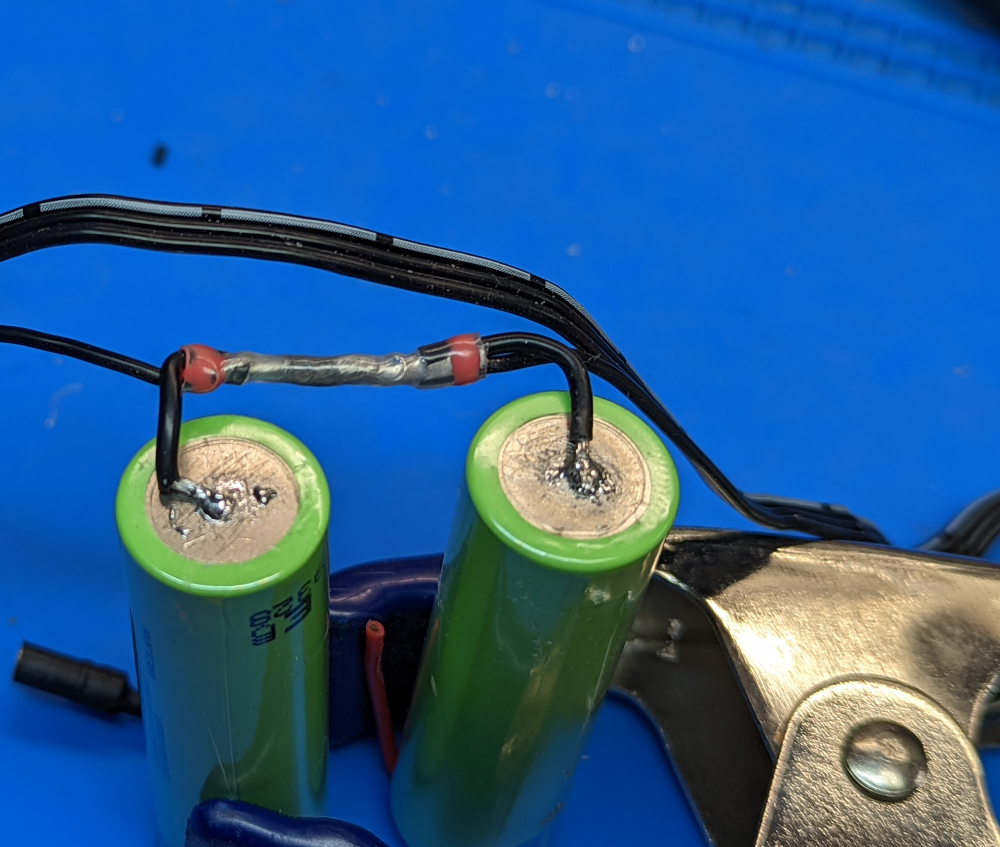
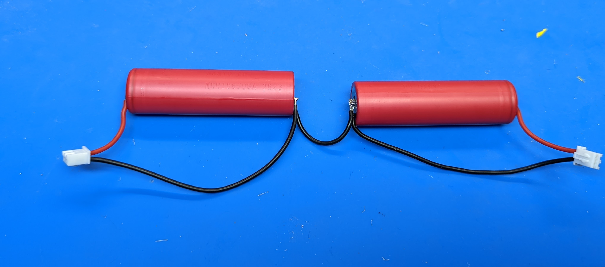

Step 1: Battery assembly
==========================
**Warning**: In this step, you will be soldering leads to Li-Ion batteries.
This could be dangerous if not done right! Please read all instructions
carefully and wear eye protection. You are working at your own risk!

Materials and tools used:

* Two 18650 Li-Ion batteries

* Battery  wire harnesses (from kit of parts)

* Spacers

* Large diameter shrink wrap

* Soldering Iron, solder, flux

1. Solder the two wire leads from the black battery wire harness to negative (-)
   terminal of each battery. Follow instructions on `this page <https://oscarliang.com/solder-li-ion-battery-18650/>`__
   for soldering. Tip: an easy way to keep the battery vertical while soldering
   is by using the clamp as shown in the photo below.

2. Turn the batteries over, with the positive terminal up. Use voltmeter to
   check the voltage difference between the positive terminals of the two batteries.
   If it is more than 0.1V, find a low ommage resistor (1 Ohm or about);  press and hold
   it against the two positive terminals, to equalize the voltage.

