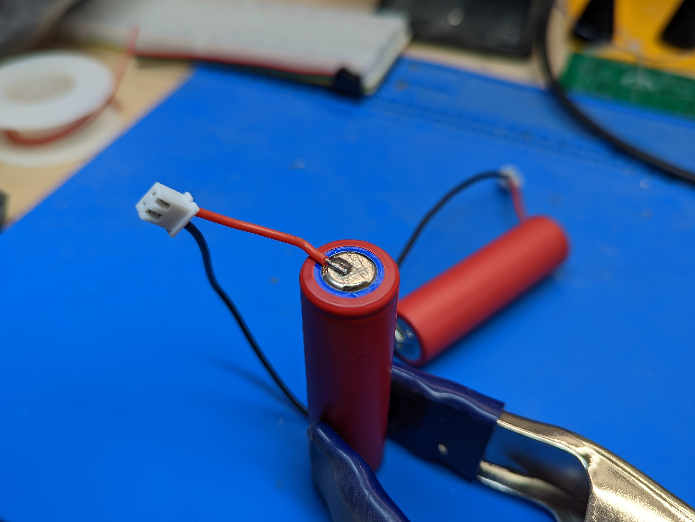

Step 1: Battery assembly 1
==========================
**Warning**: In this step, you will be soldering leads to Li-Ion batteries.
This could be dangerous if not done right! Please read all instructions
carefully and wear eye protection. You are working at your own risk!

Materials and tools used:

* Two 18650 Li-Ion batteries

* Battery  wire harnesses (from kit of parts)

* Spacers

* Large diameter shrink wrap

* Soldering Iron, solder, flux

1. Solder the two wire leads from the black battery wire harness to negative (-)
  terminal of each battery. Follow instructions on `this page <https://oscarliang.com/solder-li-ion-battery-18650/`__
  for soldering. Tip: an easy way to keep the battery vertical while soldering
  is by using the clamp as shown in the photo below.

