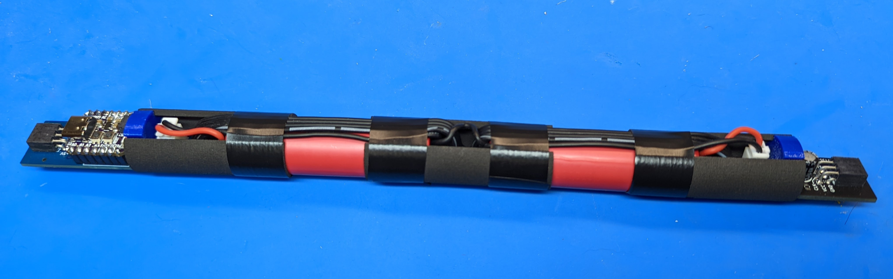
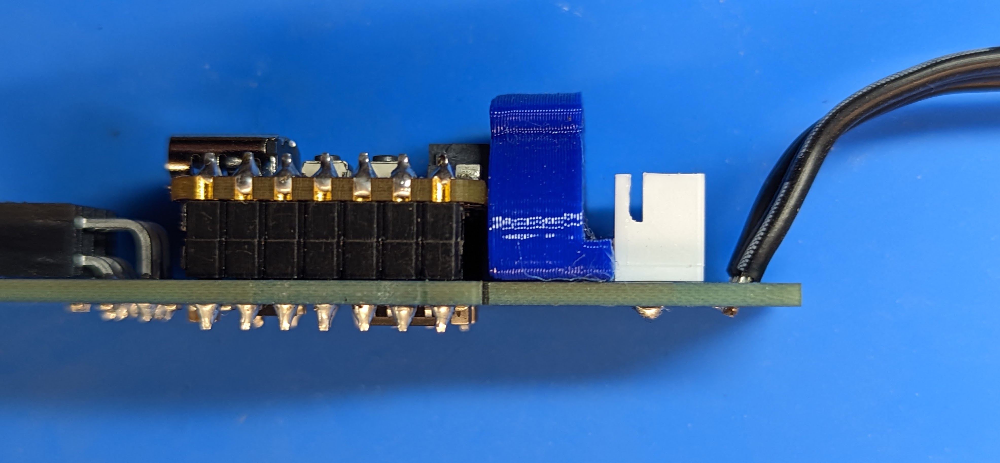

Step 1: Battery assembly
==========================
**Warning**: In this step, you will be soldering leads to Li-Ion batteries.
This could be dangerous if not done right! Please read all instructions
carefully and wear eye protection. You are working at your own risk!

Materials and tools used:

* Two 18650 Li-Ion batteries

* Battery  wire harnesses (from kit of parts)

* Spacers

* Large diameter shrink wrap

* Soldering Iron, solder, flux

1. Solder the two wire leads from the black battery wire harness to negative (-)
   terminal of each battery. Follow instructions on `this page <https://oscarliang.com/solder-li-ion-battery-18650/>`__
   for soldering. Tip: an easy way to keep the battery vertical while soldering
   is by using the clamp as shown in the photo below.

.. figure:: images/battery-1.jpg
   :alt: Battery
   :width: 80%

2. Turn the batteries over, with the positive terminal up. Use voltmeter to
   check the voltage difference between the positive terminals of the two batteries.
   If it is more than 0.1V, find a low ommage resistor (1 Ohm or about);  press and hold
   it against the two positive terminals, to equalize the voltage.

3. Take the red wire harness from the kit of parts and solder the two red leads
   to positive terminals of the batteries. Make sure the direction they are
   pointing is same as direction the black leads on the negative terminal.

4. Arrange the two batteries in line, placing the spacer between. (Use the
   spacer with partly covered top and bottom). Carefully straighten the wires
   along the surface of the batteries, making sure they do not cross. Use electric
   tape to hold them. Make sure that the bullet point connectors reach  at least
   3.5cm beyond the end of the battery on each side.

.. figure:: images/battery-5.jpg
   :alt: Battery
   :width: 80%

5. Take the piece of the large diameter shrink wrap and put it over the middle
   section of battery assembly. Push the batteries and spacer tightly together,
   being careful not to pinch any wires. Use the heat gun at low temperature
   setting  to shrink the wrap.

