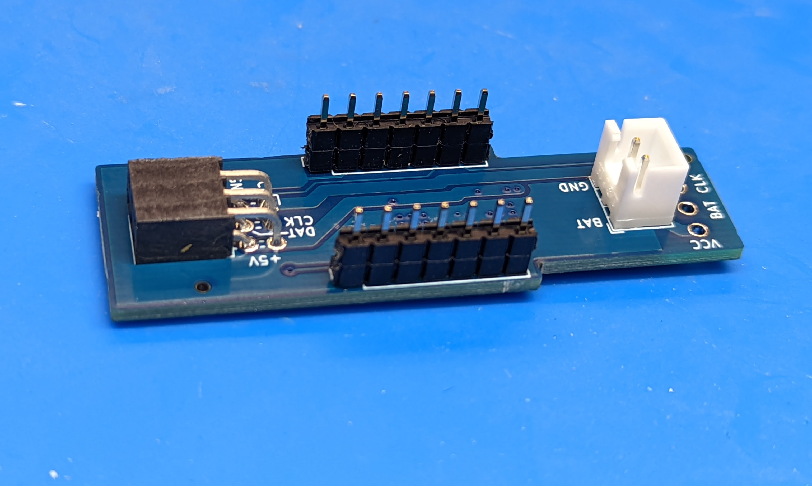

Step 6: Controller assembly
===========================

1. Solder the male headers to the ItsyBitsy; for ItsyBitsy M4, only solder the
   headers along the two long sides of the board.

2. Solder the POV shield board
   to these headers underneath the Itsy Bitsy, forming a "sandwich" of two boards
   as shown in the photos below. Use flush cutters to trim the long pins of
   the headers so they are not in the way.

