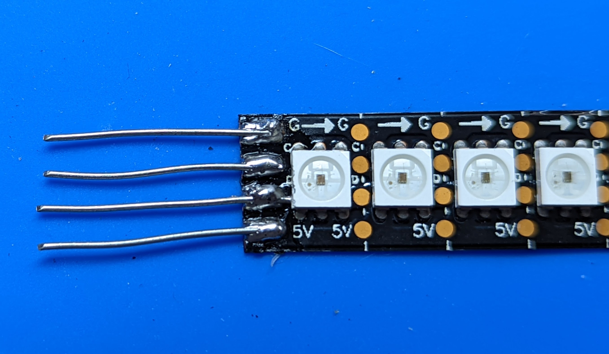
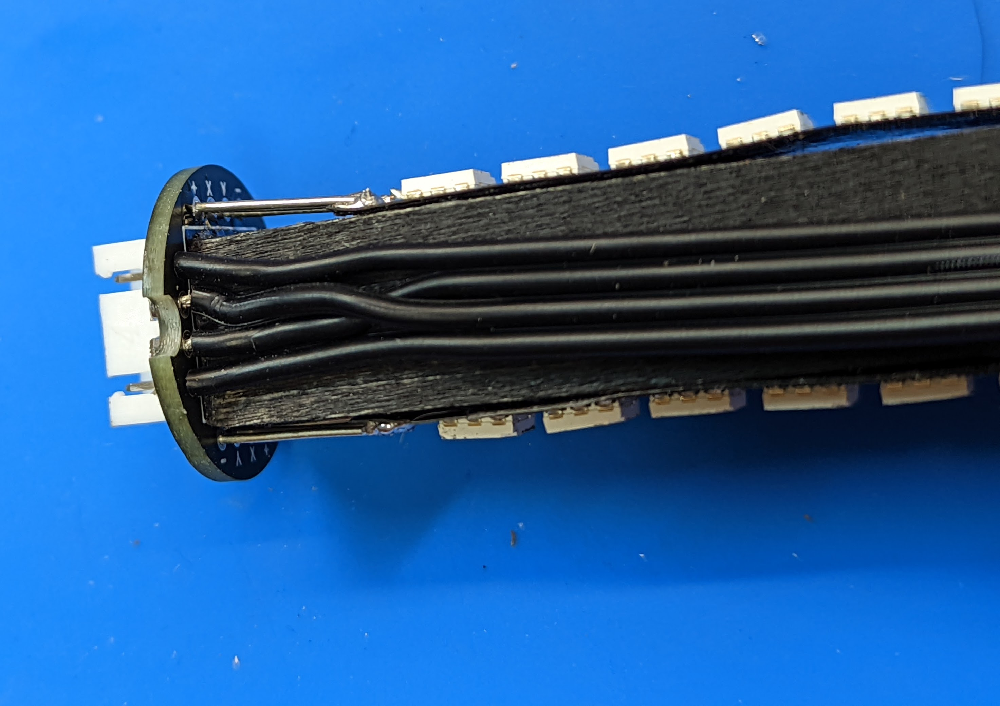
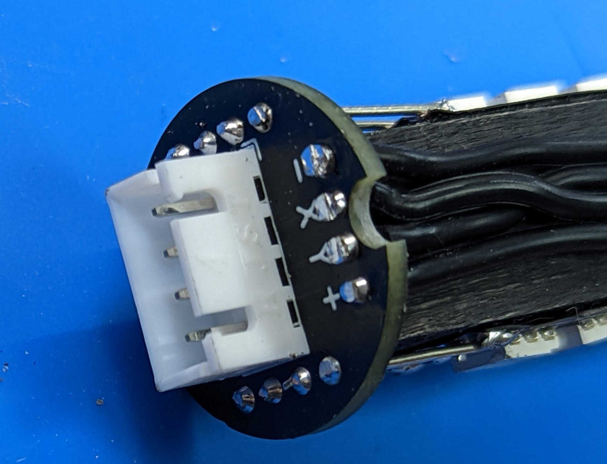

Step 5: Controller wiring
=========================
Materials:

* Controller  wire harness (55cm, black, 5-wire)

* The remaining  LED assembly (without the switch)

Before starting assembly, you need to match the wires of the wire harness to the
contacts of the power distribution board. The wire harness contains 5 wires:

* VCC (with white stripe)

* Data

* Clock

* GND

* BAT (with bullet connector)

VCC should be connected  to 5V contacts of the LED strips and  (through the switch) to
the positive terminal of the batteries; GND connects to GND contacts of the
LED strip and negative terminal of the batteries. BAT directly connects to
the positive terminal of the  batteries (it is used for charging the batteries).

Four of these wires will need to be soldered to holes in the power distribution
board as follows:

* VCC - to hole labeled +

* Data, Clock - to holes labeled X, Y (see below)

* GND - to hole labeled -

The  correspondence between Data/Clock and X/Y depends on the signal order on
your LED strip (unfortunately, there is no standard). Place the strip  so that 
the signal travels from left to right. X is the **second from the top** signal,
and Y is the **third**. For example, for the strip below, the order of signals is
(from the top) GND, C (clock), D (data), 5V; thus, in this case we should
connect X=Clock, Y=Data

1. Solder the VCC, Data, Clock, and GND wires from the wire harness to power
   distribution board using the wire order described above. Trim the wires.

2. Feed the BAT wire through the cutout. Use zipties to fasten the wiring and
   LED strips to the dowel, similar to what you did with the other dowel.
