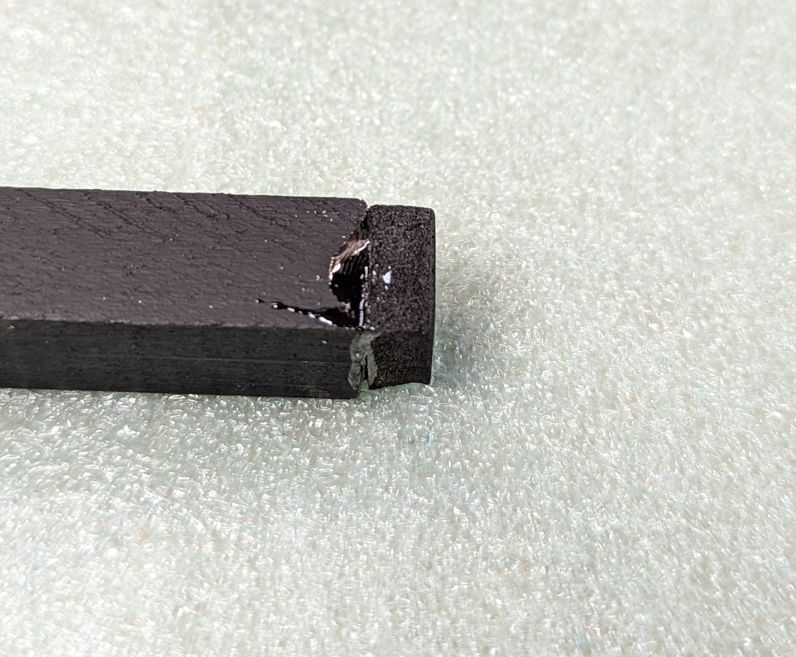

Step 2: Dowels
==============

1. Take the two  1/2" square wood dowels. Cut each of them to 51cm length; try to
   keep the cuts square.

2. Spray paint each of them black. Let dry (you can work on the other steps
   while the dowels are drying).

3. Take the battery assembly created previously. Press the headers soldered to the  Power Distribution
   board (PDB) fully into the end of the dowel. Use the
   square drawing on the back for alignment with the dowel. You will need to use
   some force to push the headers  into the wood;  if necessary,
   use the spacer to make it easier to push. Repeat the same with the other dowel
   and power distribution board.

4. Remove the PDB from the dowel. Mix some epoxy glue, apply it to the end of
   the dowel and replace the PDB seating it fully. Repeat with the second PDB
   and dowel. Be careful that no epoxy gets on the holes for wires.

5. Cut two  12x12mm square from the EVA foam. Use epoxy to glue it  to the free  end
   of each  of the dowels.
   Leave for couple of hours to let the epoxy harden.

