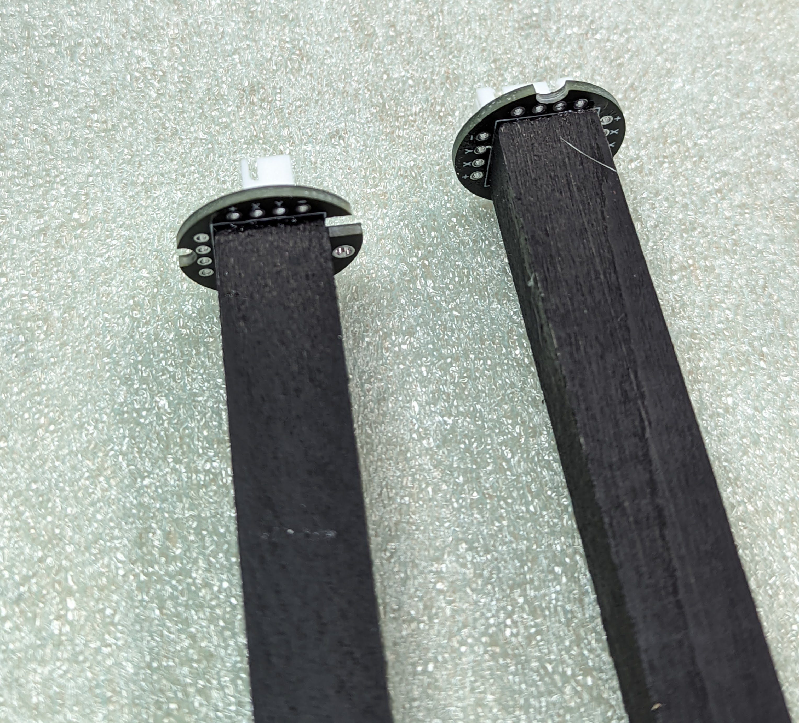

Step 5: Dowels
==============

1. Take the two  1/2" square wood dowels. Cut each of them to 52cm length; try to
   keep the cuts square.

2. Spray paint each of them black. Let dry (you can work on the other steps
   while the dowels are drying).

3. Take the Power Distribution board (PDB) and press it fully into the dowel. Use the
   square drawing on the back for alignment with the dowel. If necessary, tap it
   lightly with a block of wood or rubber mallet (do not use hammer) until it is
   fully seated into the wood. Repeat the same with other dowel and power
   distribution board.

.. figure:: images/dowel-1.jpg
   :alt: Dowel with PDB
   :width: 80%

4. Remove the PDB from the dowel. Mix some epoxy glue, apply it to the end of
   the dowel and replace the PDB seating it fully. Repeat with the second PDB
   and dowel.

5. Cut two 12x12mm squares from the EVA foam. Use epoxy to glue them to the opposite
   ends of the dowels. Leave for couple of hours to let the epoxy harden.

.. figure:: images/dowel-3.jpg
  :alt: Dowel with EVA foam square
  :width: 80%
