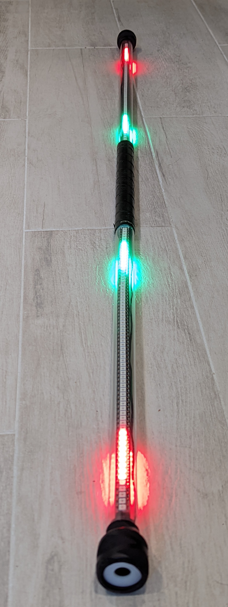

Step 9: Final assembly
===============================

Warning: inserting the whole assembly in the tube takes some time, and getting
it out is even more time-consuming, so make sure you test the staff before
going further!

1. Turn the staff off.

2. Lay out the whole assembly (controller, LED assembly, battery assembly,
   second LED assembly, switch) in line. Insert the spacers on both sides of
   the battery assembly fitting the wires inside. Make sure no wires are
   pinched.  Insert the spacer between the switch and the battery assembly.

3. Start inserting the whole assembly into the tube, controller end first. (The
   spacers may fall out; reinsert them just before the corresponding part goes
   into the tube, paying attention to the wires).

4. Continue until the  assembly is fully in. Push to fully insert the switch.
   If everything worked as expected, the controller should now be level with the
   opposite end of the tube or several millimeters inside the tube. In the
   latter case, you can cut another 18mm foam circle and place in on top of the
   controller cover.

5. Cover the controller end of the tube with the PVC cap.

6. Take the other PVC cap; use scissors or model knife to cut a circle (about
   15mm) in it. Insert the switch spacer into the cap, with the angled side facing out.
   Use this assembly to cover the switch end of the tube. (The spacer prevent
   the switch from turning off  if you drop the staff.)

   .. figure:: images/cap-1.jpg
      :alt: Switch cap and spacer
      :width: 40%

   .. figure:: images/cap-2.jpg
      :alt: Switch cap and spacer
      :width: 40%

   .. figure:: images/cap-3.jpg
      :alt: Switch cap and spacer
      :width: 40%

7. Apply the tennis overgrip tape over the middle part of the tube,
   containing the battery assembly and spacers -everything between the
   Power Distribution Boards. You can watch this video to see the proper
   way of applying the overgrip tape:
   https://www.youtube.com/watch?v=HNc34XlUBww. Make sure to keep the overlaps
   between tape turns small - if you make them too large, your tape will run out
   before you reach the end of battery assembly.

   .. figure:: images/griptape.jpg
      :alt: Grip tape
      :width: 60%

This completes your staff assembly - congratulations!!

Please check the User Guide for instructions on using your staff.

