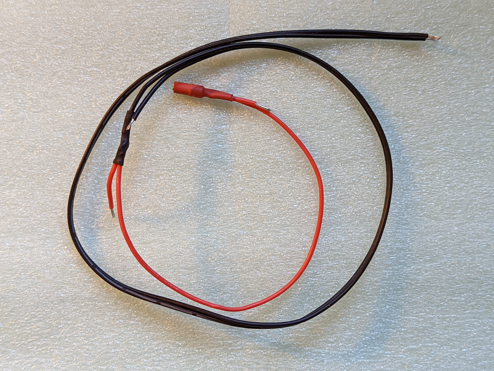

Kit of parts
============
Below is listing of parts included in kit of parts:

.. figure:: images/kit-1.jpg
    :alt: Kit of parts
    :width: 80%

1. Custom-made POV controller  for ItsyBitsy, containing Inertial Motion Unit, battery
   charge circuit, and more.

2. Two Power Dsitribution Boards (PDB). Note: PDB exist in two variants,
   PDB-A and PDB-B. Choose the variant that matches the order of signals on your
   LED strip (see below)

.. figure:: images/kit-2.jpg
   :alt: POV shield and PDB
   :width: 80%

3. Three wire harnesses:

    * 4-wire, 28 cm battery wire harness (black)

    .. figure:: images/kit-harness1.jpg
    :alt: Battery wire harness
    :width: 80%

    * Another wire harness for the battery and switch (long, with red wire)

    * Controller wire harness (5 wire, 55cm, black, with JST XH connector at one end)

.. figure:: images/kit-harness3.jpg
   :alt: Controller wire harness
   :width: 80%

5. A rocker switch

.. figure:: images/kit-switch.jpg
   :alt: Controller wire harness
   :width: 40%

6. Shrink tubing: 15 cm of 25mm diameter tubing and two 5cm pieces of 8mm flat tubing.

.. figure:: images/kit-shrink.jpg
   :alt: Shrink tubing 
   :width: 70%
