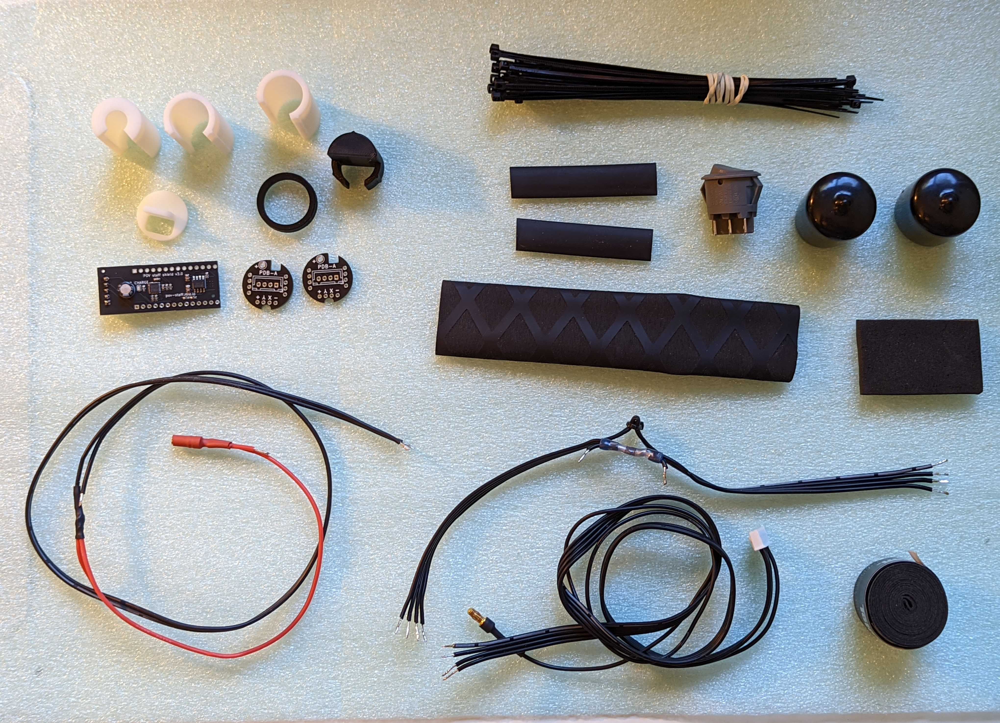
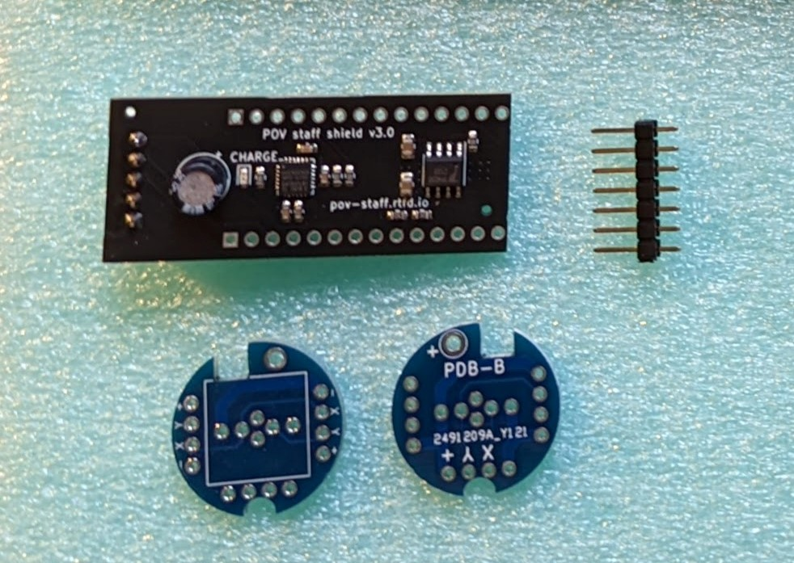
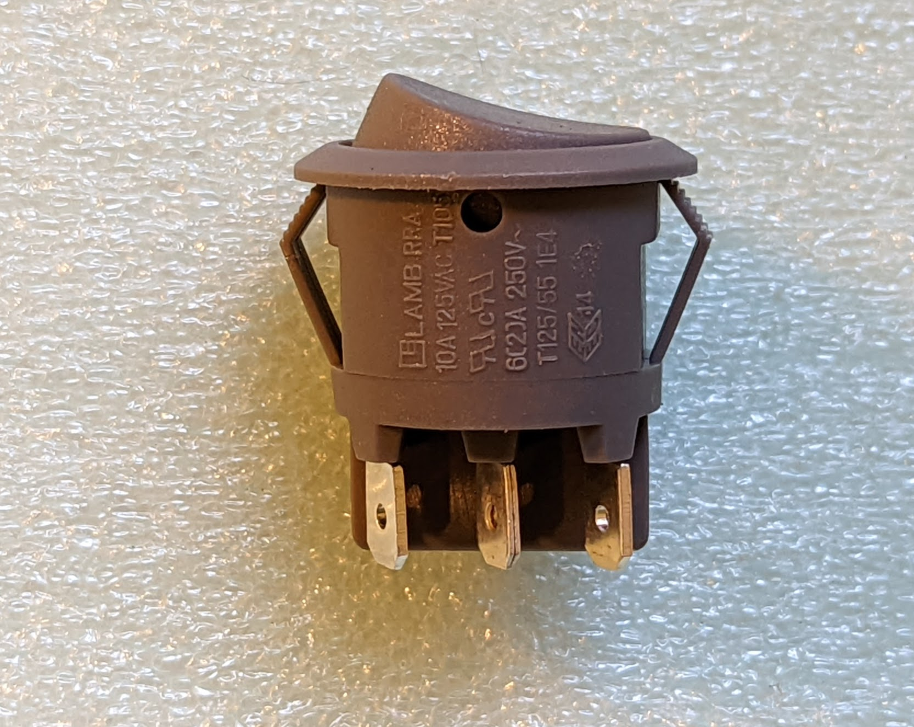
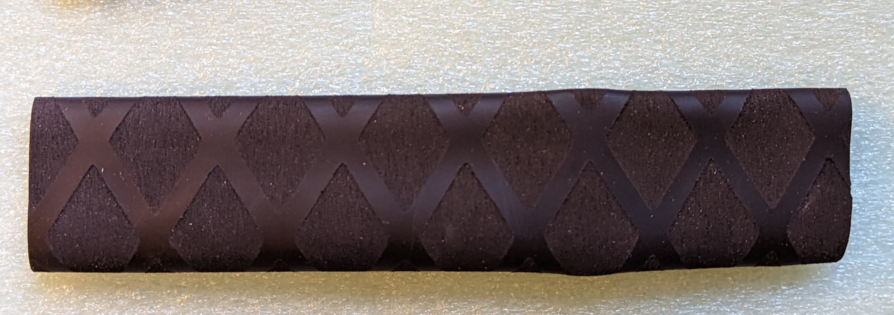
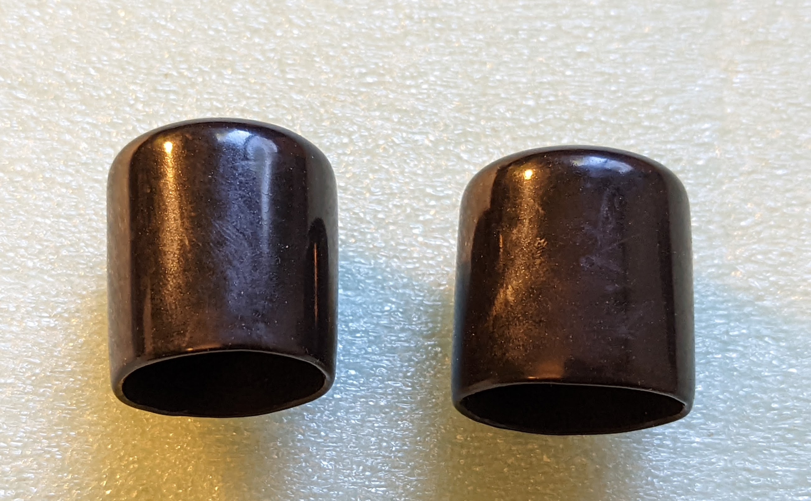
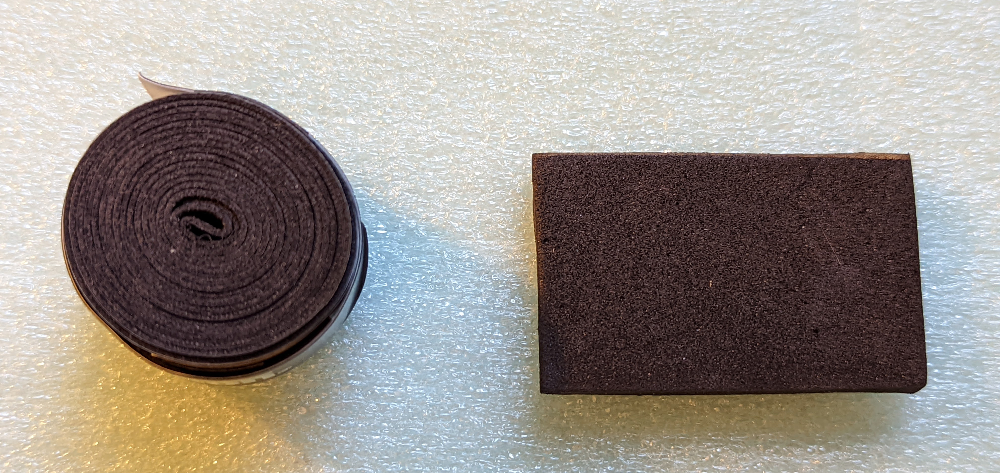
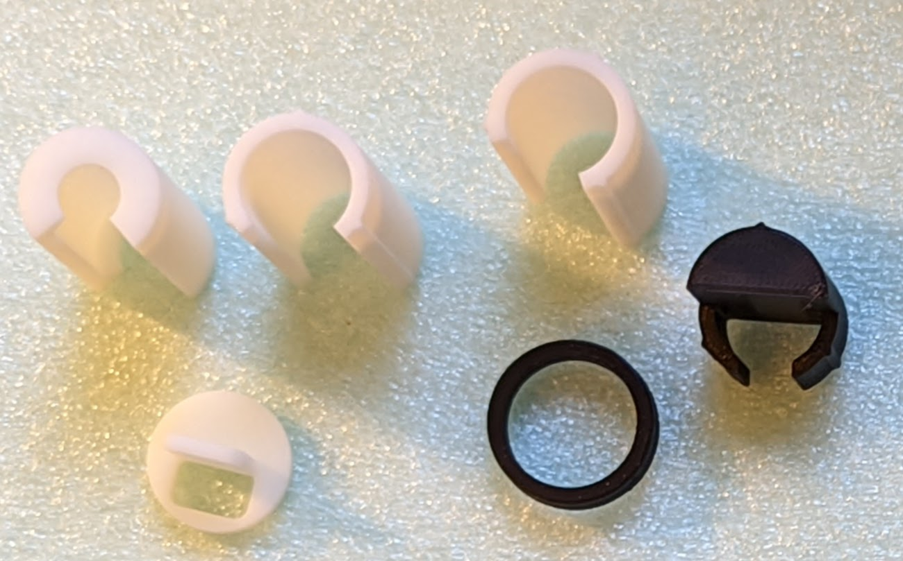

Kit of parts
============
Below is listing of parts included in kit of parts:

1. Custom-made POV controller  for ItsyBitsy, containing Inertial Motion Unit, battery
   charge circuit, and more.

2. Two Power Distribution Boards (PDB). Note: the PDB exists in two variants,
   PDB-A and PDB-B. Choose the variant that matches the order of signals on your
   LED strip (see below)

3. Three wire harnesses:

    * 4-wire, 28 cm battery wire harness (black)

    .. figure:: images/kit-harness1.jpg
       :alt: Battery wire harness
       :width: 60%

    * Another wire harness for the battery and switch (long, with red wire)

    .. figure:: images/kit-harness2.jpg
       :alt: Battery wire harness
       :width: 60%

    * Controller wire harness (5 wire, 55cm, black, with JST XH connector at one end)

    .. figure:: images/kit-harness3.jpg
       :alt: Controller wire harness
       :width: 60%

5. A length of solid core 22 AWG wire, to use as LED leads.

6. A rocker switch

7. Shrink tubing: 15 cm of 25mm diameter tubing and two 5cm pieces of 8mm flat tubing.

8. Two PVC endcaps

9. Tennis grip tape

10. EVA foam (6mm thick)

11. Zipties (2mm wide)

12. (Optional) Set of 3d printed spacers

12. (Optional) Itsy Bitsy M4

Power Distribution Board variants
----------------------------------
As mentioned above, there are two variants of the kit which contain different
Power Distribution Boards: PDB-A and PDB-B. The correct option for you depends on
the order of signals on your LED strips; unfortunately, there is no standard order.

Place the strip horizontally so that the signal travels from left to right.

* If the top signal is Ground (usually labeled G) and bottom signal is 5V, then
  you need **variant A**.

  .. figure:: images/led-2.jpg
     :alt: Signal order for variant A
     :width: 70%

* If the top signal is 5V and bottom signal is Ground, you need **variant B**.
