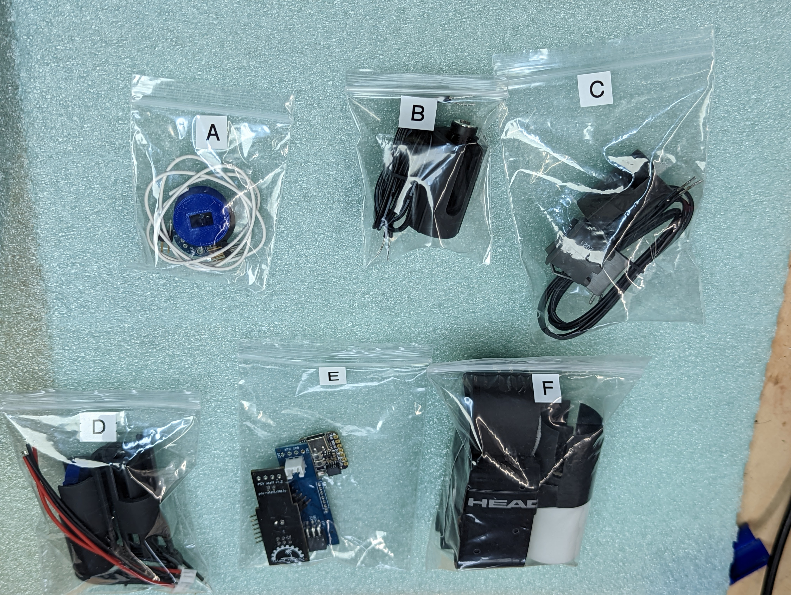

Kit of parts
============
Below is listing of parts included in the kit sold on Tindie.

* **Bag A**: materials for LED assemblies

   .. figure:: images/kit-full.jpg
      :alt: Kit of parts
      :width: 80%

   * two power distribution boards (PDB), one labeled "CHARGE", the other "SWITCH"

   * 2x3 pin headers (to be soldered to the PDBs)

   * 22AWG solid core wire (to be soldered to LED strips)

   * 3d printed press tool, to be used for pressing hte PDBs into the dowels. Discard after use

* **Bag B**:

   .. figure:: images/kit-bagB-annotated.png
      :alt: Kit of parts, bag B
      :width: 60%

   1. 2-pin wire (55 cm, 24 AWG)

   2. 3d printed housing for charge connector

   3. Charge connector

* **Bag C**:

  .. figure:: images/kit-bagC-annotated.png
      :alt: Kit of parts, bag C
      :width: 60%

  1. Switch

  2. 3d printed housing for the switch

  3. 2-pin wire (55cm, 20 AWG)

* **Bag D**: battery assembly components

  .. figure:: images/kit-bagD-annotated.png
      :alt: Kit of parts, bag D
      :width: 60%

  1. two 2-pin wires, with JST XH connector

  2.  3d printed spacer, to go between batteries

  3. Two 3d printed spacers to go at the neds of batteries

  4.  4-pin wire (22cm, 22AWG)

  5. black wire, 5.5 cm, 22 AWG

* **Bag E**: electronics

  .. figure:: images/kit-bagE-annotated.png
      :alt: Kit of parts, bag E
      :width: 60%

   1. QT Py ESP32-S2 MCU, preprogrammed

   2. Custom-made POV controller board, containing Inertial Motion Unit, battery
     charge circuit, and more.

   3. Switch  connector board

   4. Two 7-pin  headers

* **Bag F**:

  .. figure:: images/kit-bagF-annotated.png
      :alt: Kit of parts, bag F
      :width: 60%

   * two 3d printed end protectors

   * two foam sleeves

   * two shrink wrap sleeves

   * tennis grip tape
