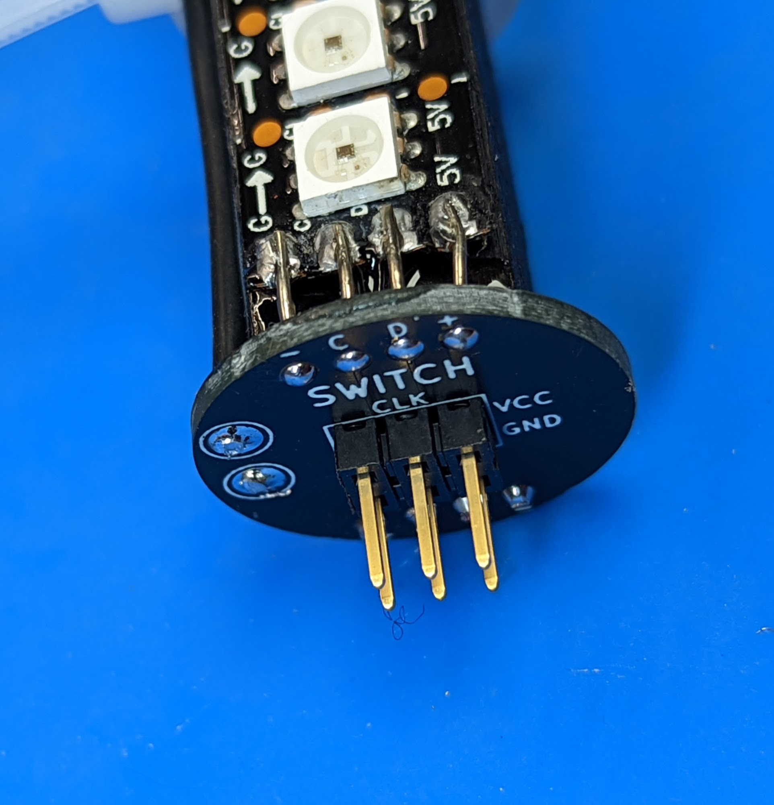

Step 3: LED assemblies
==============

Materials and tools:

* Wood dowels (from step 2)

* LED strips

* 22AWG solid core wire (from kit of parts)

* Soldering iron

Steps:

1. Get the LED strip(s). If they are inside waterproof sheaving, remove and
   discard the sheaving. If they have any wires soldered, de-solder them; remove
   excess solder using a braid wick. If you ordered 1m or 2m strips, cut them into
   50 cm pieces, making sure to leave as large as possible soldering pads in the
   beginning of each strip (this should be easy, as usually longer strips are
   created by soldering together 50cm ones, so you will be just undoing someone
   else's work).

2. Tin the pads in the beginning of each LED strip.

3. Solder 2cm long pieces of 22AWG wire to each of the pads. The easiest way to
   do it is as follows:

   * Strip 2cm of insulation from the end of wire; do not cut it yet.

   * Holding the wire by insulated part, solder the stripped end to the pad.
     You will be soldering very close to the first LED, so please watch your
     iron carefully - do not touch the LED!

   * Cut the wire

    .. figure:: images/led-1.jpg
       :alt: Soldering wire to LED strip
       :width: 80%

   .. figure:: images/led-2.jpg
      :alt: Soldering wire to LED strip
      :width: 80%

4.  Insert the soldered wires into the holes of the power distribution board you
    had previously attached to the wood dowels (use the sides without cutouts).
    Remove the backing paper from the adhesive strip on the back of the LED and
    attach the strip to the wood dowel, aligning it so that the
    end of the strip is about 5mm away from the power distribution board.

5.  Solder the wires to the power distribution board. Trim them using flush cutters.
    Repeat the previous steps for all 4 LED strips.

**Note**: the adhesive on LED strips is not very strong, so your strips might
start peeling off. It is OK; we will make a more permanent attachment later.
