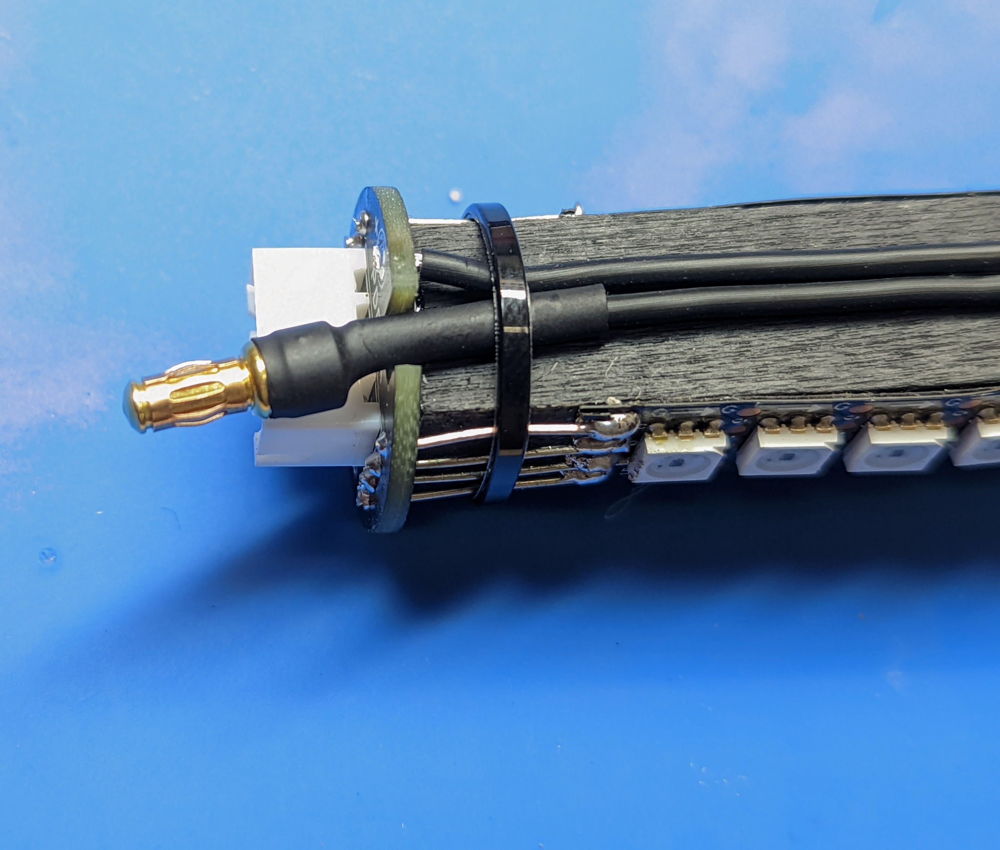
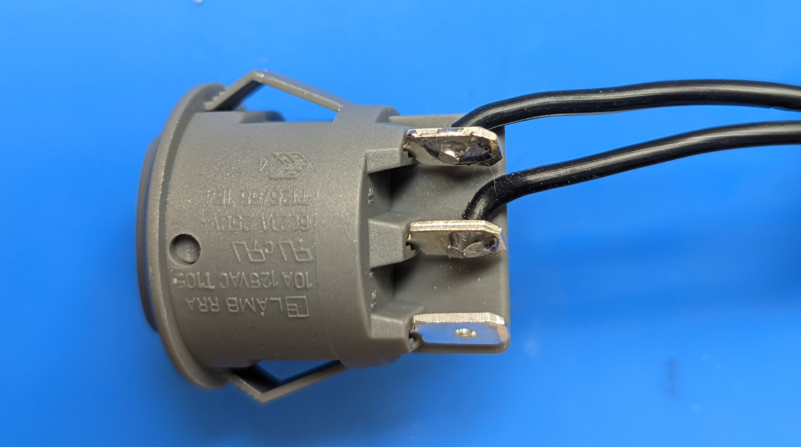
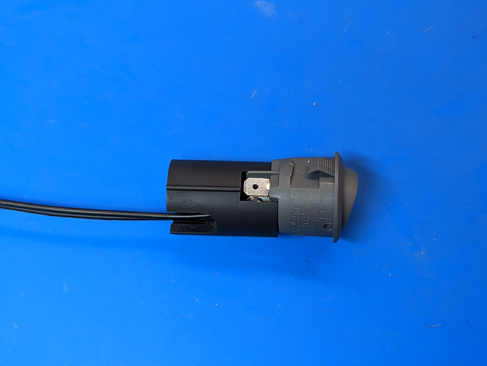
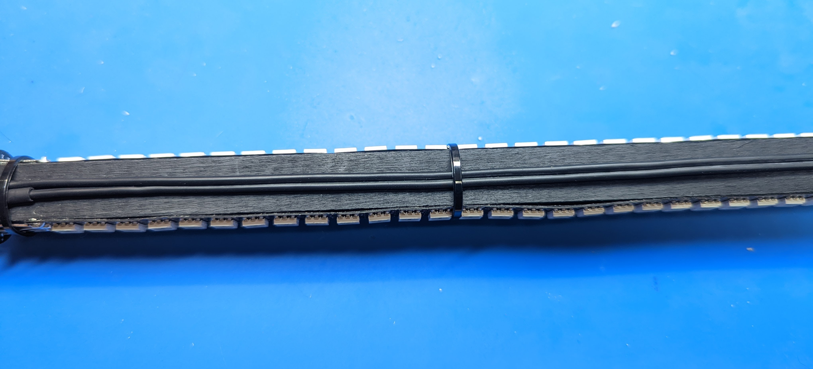
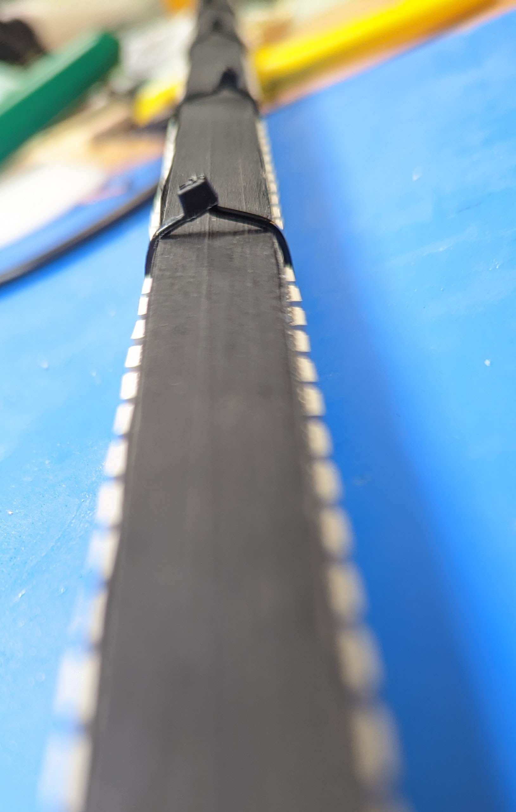

Step 4: Switch
==============
Materials:

* Switch

* Switch spacer

* Switch wire harness (55cm, black, 2-wire)

* One of LED assemblies from the previous step

1. Solder the wire harness to the Power Distribution Board as shown in the photo
   below. Use the flush cutters to trim  the soldered wire.

2. Run the wires along the length of the dowel. Solder the opposite ends of
   the wires to the switch; as before, trim the soldered wires using flush cutters.
   Note: one of the wires must be soldered to the middle contact, and the other,
   to one of the other contacts (doesn't matter which one). It doesn't matter
   which of the two wires is soldered to the middle contact.

3. Use zipties  to fasten the LED strips and the wiring to the dowel.
   The zipties should fit in the spaces between LEDs. The head of the
   zipties should be in the middle of the empty side of the dowel (without LEDs
   or wiring) - not at the corner! Place zipties every 7-8 cm or so.
   Tighten them (but not too tight, to prevent them from breaking) and trim.

