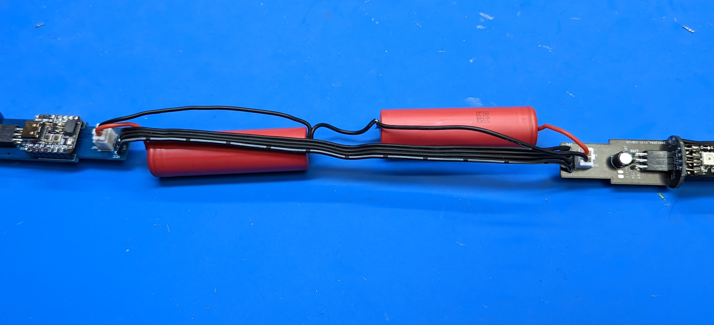

Step 8: Testing
===============================
Before continuing, let us do the final test. Make sure to clear large area on
your desk or floor for this step.

Take the controller assembly you had created in the previous step and plug it
into the LED assemblies as follows:

* The POV controller shield with the QT Py should be plugged into the LED assembly
  labeled CHARGE.

* The switch connector  board should be plugged into the LED assembly labeled SWITCH

**The LED assemblies are not interchangeable!**

In each case, the board must be plugged into PDB so that the label CHARGE (or SWITCH)
should be above the plugged board:

.. figure:: images/testing-1.jpg
     :alt: Connecting LED assemblies
     :width: 80%

.. figure:: images/testing-2.jpg
     :alt: Connecting LED assemblies
     :width: 80%

Double-check that everything is plugged correctly. Make sure that the switch at
the end of SWITCH LED assembly is in the middle (Off) position.

Now, take the batteries. Plug the battery connectors into the 2-pin JST XH
connectors on the POV shield board and the switch board (doesn't matter which battery goes into which board).

Turn the switch on (you will have to try both positions to figure out which of them is ON).

The staff should come to life; it will show the battery voltage, by
lighting part of the LED strips. The longer the strip, the higher the battery charge.

Note: the software uses the motion sensor (IMU). If you turn the staff on while the
staff (to be precise, the electronics board containing the motion sensor) is horizonal,
the staff goes into charging mode, so it will show the battery voltage but will not
show any images. If you want to test images, make switch the staff on holding
the sensor board vertical. See User guide for details.

If this works, you can turn the staff off and  proceed to the next step. 
