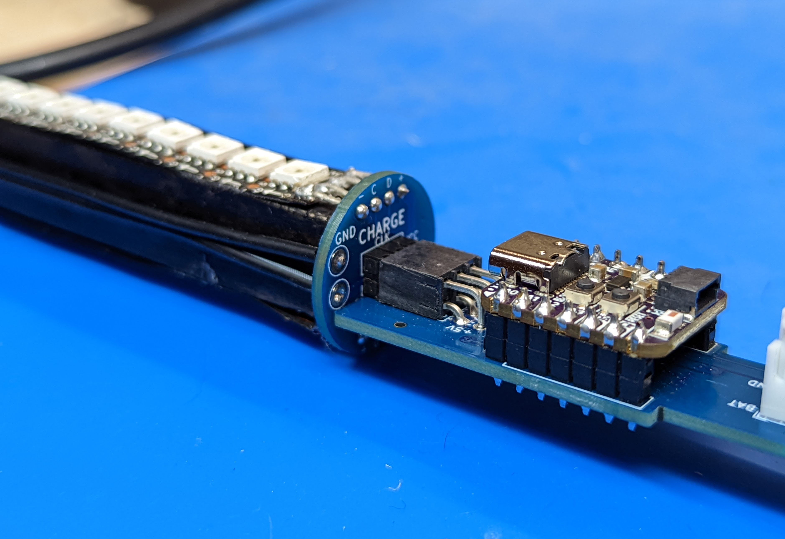
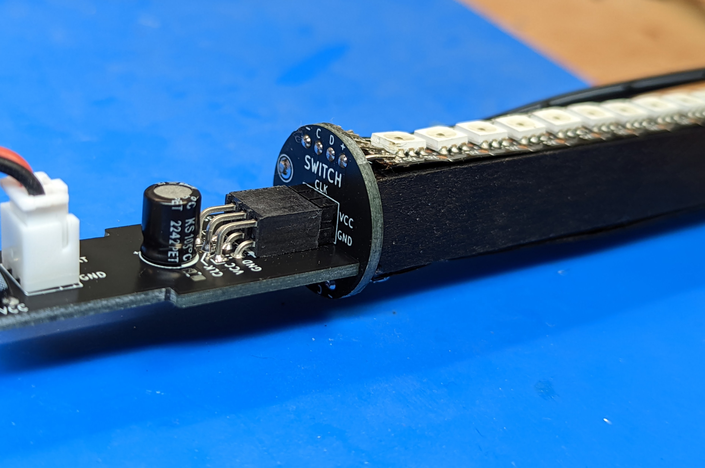

Step 7: Testing
===============================
Before continuing, let us do the final test. make sure to clear large area on
your desk or floor for this step.

Take the controller assembly you had created in the previous step and plug it
into the LED assemblies as follows:

* The POV controller shield with the QT Py shoudl be plugged into the LED assembly
  labeled CHARGE.

* The other board shoudl be plugged into the LED assembly labeled SWITCH

The LED assemblies are not interchangeable!

In each case, the board must be plugged into PDB so that the label CHARGE (or SWITCH)
should be above the plugged board:

