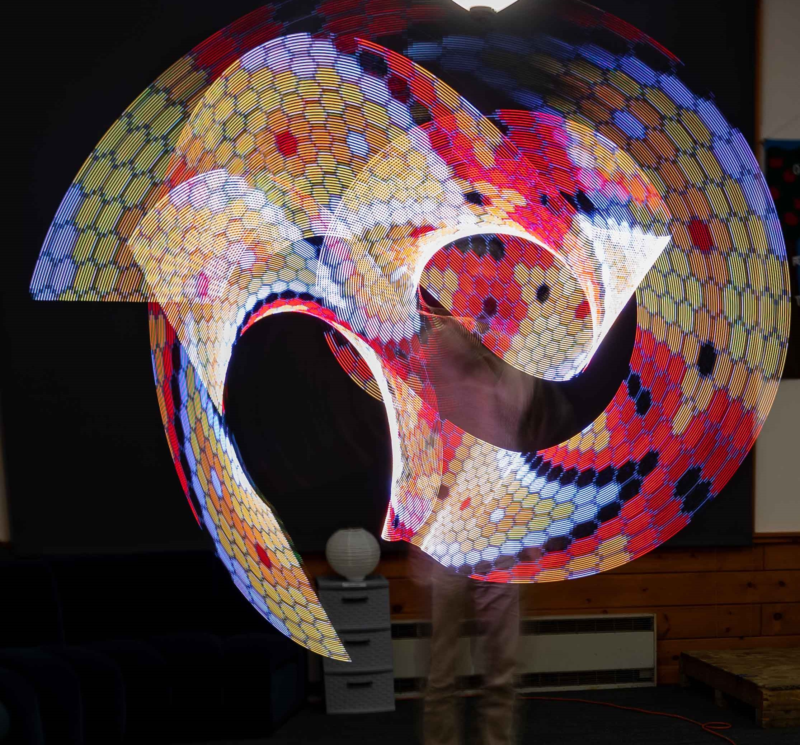

###############################
Persistence of Vision LED staff
###############################

This guide contains documentation for Persistence of Vision (POV) LED staff project,
created by Alexander Kirillov <irobotics.store@gmail.com>.

This document describes version 4.1, which was released on May 10, 2023.  An
earlier version of this project was documented on
`Instructables web site <https://www.instructables.com/Persistence-of-Vision-LED-Staff/>`__.
The version described here contains several improvements compared to the earlier
one, see below.

For those wishing to reproduce this project, we are offering a kit of parts for
sale through our `Tindie store <https://www.tindie.com/stores/irobotics/>`__.
However, all design files, software, BOM and more are published under open
source license, so anyone can build their own version from scratch. You can
find these files in the project GitHub repository: https://github.com/shurik179/povstaff

Overview
********

It is well known that even after a light has been turned off, human eye keeps
"seeing" it for a fraction of second. This is known as Persistence of Vision, or
POV, and it allows one to "paint" pictures by quickly moving a strip of LEDs,
drawing one line of an image at a time in quick succession. If you search online
(e.g. on Etsy), you can find quite a few toys based on this idea: pois, staffs, and more.

However, these are expensive: typical prices for a POV staff of decent
resolution start at $500, and they use proprietary software, so there is no easy
way to modify their behavior or add extra functionality. Thus, when looking for
a birthday gift for a friend who enjoys painting with light, I decided to create
my own open source version using readily available components.

My project builds upon the outstanding `work of Phillip Burgess and Erin St Blaine
<https://learn.adafruit.com/pov-dotstar-double-staff>`__
from Adafruit; however, I made a few changes, upgrading the electronics.

Key Features
************

* It is a two-sided staff, of total length 141 cm (55in); it is not collapsible.
  Each side of the staff has two 50cm/72 pixels LED strips, for the total of 288 LEDs.
  Thus, you can use it to show images with 72-px resolution.

* Staff is powered by two 18650 Li-Ion batteries, which should be enough for at
  least 1 hr show, possibly as much as 2 hours, depending on intensity of your
  images. The batteries can be recharged via micro-USB connector; full charge
  time is about 5 hrs.

* Images (in bitmap format) can be easily uploaded to the staff over WiFi. It has
  enough memory for about 50 images. The order in which images are shown is
  described in a separate plain text file, where you can put a list of
  images and durations. An image can be listed there several times, or none at all.

* The staff contains an Inertial Motion Unit (IMU) which can be used to detect
  when the staff is in motion. The software uses it to adjust update frequency
  for images, so the images will not appear stretched or compressed regardless
  of how fast you are rotating it. You can also use it for controlling your
  show: e.g. stopping the staff horizontally is used as a signal to move to the
  next image in the slideshow.

* The software is based on Arduino IDE. It is available under an open source
  license and is easy to modify to suit your needs.

Differences from  version 3
****************************

* New MCU (ESP32-S2 QT Py)

* Wireless uploading of images

* Many changes to wiring

* New 3d printed spacers and other components, mostly printed in Nylon for impact resistance

* Foam protectors at the ends of the staff, to protect the staff when dropped

.. toctree::
    :caption: Table of Contents
    :maxdepth: 2

    build
    usage
    license
