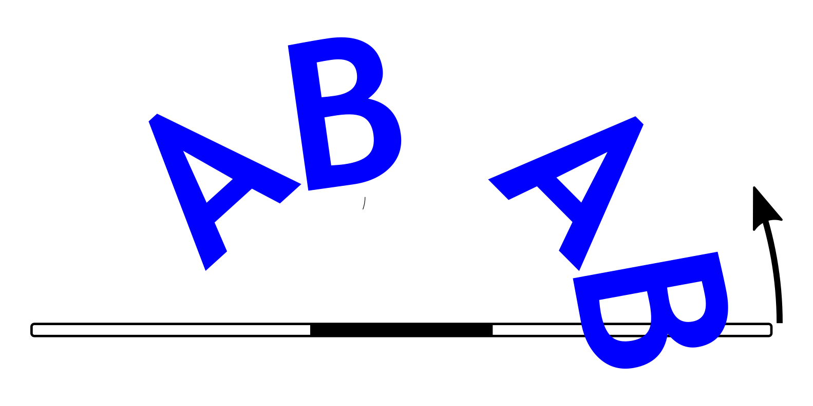

Uploading new images
====================

Finding images
--------------
You can use any image satisfying the following requirements:

* Images must be in bitmap (BMP) format, with 24 bit color depth. Use any
  software you like to convert images in other formats to bmp - e.g. you can use
  Microsoft Paint 3D.

* The images are shown one **horizontal** line at a time; thus,  it is
  recommended to use images with **width** of 72 pixels - to match the number
  of LEDs on the staff. Maximal image size is 72x288 pixels.

* Image filenames must be at most 30 symbols long and can only contain letters,
  numbers, dashes and underscores. No spaces or special symbols!

You can create your own images or search for existing ones.  A good source for
POV image patterns is `Visual  POI Zone <https://visualpoi.zone/patterns/>`__.
When downloading images from there, make sure to choose `Visual poi V4 mini (72px)`
option. You will also need to rotate images 90 degrees.

Please note that the same color (i.e. the same RGB values) can look quite
different on the screen of your computer and on LED strip. Experiment with
colors to get some feel for it.

To help you figure out correct rotation and orientation of images, the pictures
below show the same image in BMP file and how it will look when using the POV staff.

.. figure:: images/image_infile.png
   :alt: Image in file
   :width: 80%

Directory `images` in the GitHub repository https://github.com/shurik179/povstaff
contains some sample images and `imagelist.txt` file; to get started, you can
just copy the contents  of that directory to root directory of your staff.

Creating imagelist file
-----------------------

Once you have found or created your own images, move them all to the same folder
on your computer.

Now,  you need to create a list showing in which
order these images should be played during the show. Create the file
`imagelist.txt` in the same folder as the images  (or open the file if
it already exists) and put there the list of image files in the order you want
to use them in your show, one filename per line. Include the  `.bmp` extension
in each filename, and put leading slash (/) before each filename, as shown below.
Optionally, you can also add how long the image should be shown, in seconds
(whole numbers only!), separated from  filename by one or more spaces:

.. code-block:: python

   /image1.bmp 20
   /image2.bmp 41
   /image5.bmp 10
   /image1.bmp

You can include some image file more than once, or not at all - it is your
choice. The name of your image list must be `imagelist.txt`, all lower case.

Uploading images
-----------------

To upload images, place the staff on a horizontal surface (e.g. on the floor)
and turn it on. It will briefly light up to show the battery voltage and then
go into upload mode; to indicate that, every 4th LED should be lighted in light
green color.

Wait for 20-30 seconds and open  the WiFi search dialog of your computer. You
should see there a new WiFi network with the name `POVSTAFFXXXX`, where XXXX
will be replaced by a 4-digit number, unique for each staff. Connect to this
network, using the password. The password is included on the information sheet
which was included with your kit' if you misplaced it,
email `irobotics.store@gmail.com` for help.

Type in the URL field of the browser the following address: `povstaff.local:8080`.
You should see the webpage of the staff, which looks as follows:

Drag and drop the image files and the imagelist.txt file to the `drop files here`
area of the webpage.

You can delete files you no longer need by pressing on 'D' letter next to the
filename. You can also edit imagelist.txt file online by clicking on  'E'.

Once the files have been uploaded, just turn the staff off.
